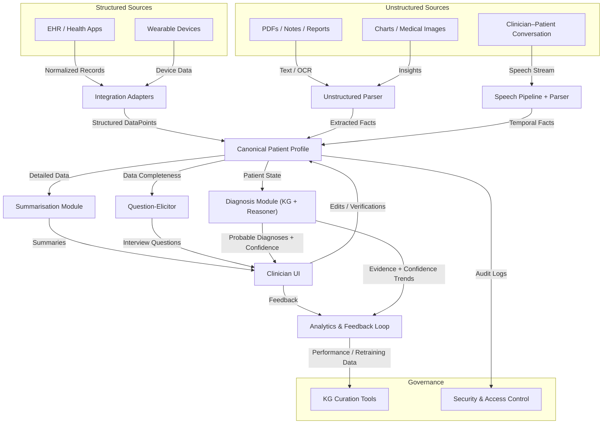

# High-Level Design (HLD) Overview — Patient Summary & Diagnosis System

## 1. System Overview

The **Patient Summary & Diagnosis System** is designed to assist clinicians in gathering, summarizing, and reasoning over patient information. The system collects structured and unstructured data, builds a canonical patient profile, generates clinician-friendly summaries, and continuously updates a probabilistic diagnosis model during patient interactions.

The design focuses on **separation of responsibilities**, modular scalability, and near-real-time performance — enabling independent development and iteration by specialized teams.

---

## 2. One-Page HLD Diagram

---

## 3. Module Responsibilities

### 1. Integration / Source Adapters

* Fetch structured records from EHRs, APIs, and devices.
* Normalize into canonical data points.
* Maintain provenance metadata.

### 2. Unstructured Ingestion & Parsing

* OCR for PDFs and images.
* NLP for clinical entity extraction and temporal reasoning.
* Confidence scoring per extracted field.

### 3. Speech Pipeline & Real-Time Parser

* Diarization, ASR, timestamping.
* Extract structured and temporal facts from conversation.
* Stream updates to Profile store.

### 4. Canonical Patient Profile

* Authoritative single source of patient data.
* Stores versioned data points with provenance, confidence, and timestamps.
* Exposes APIs for reading/writing patient state.

### 5. Summarisation Module

* Generates concise, fact-based clinician summaries.
* No diagnostic inference.

### 6. Question-Elicitor

* Detects missing or low-confidence data points.
* Suggests targeted interview questions for clinicians.

### 7. Diagnosis Module (Hybrid)

* Combines KG (explainability) + fine-tuned model (ranking/reasoning).
* Evaluates current patient state to produce probable diagnoses, confidence, and evidence references.

### 8. Clinician UI / Interaction Layer

* Displays profile summary, diagnoses, and question prompts.
* Allows edit/verify actions that feed back to the profile.
* Provides real-time updates without blocking workflow.

### 9. Audit, Governance & Curation Tools

* Track provenance, approvals, and version control of the KG.
* Manage curation workflows and evidence sourcing.

### 10. Analytics & Feedback Loop

* Collect clinician feedback and usage metrics.
* Identify drift and retrain models periodically.

### 11. Security & Access Control

* Role-based permissions and audit trails.
* HIPAA-compliant logging, encryption, and data retention.

---

## 4. Data Flow Summary

**Pre-Visit**

1. EHR & device adapters collect structured data → Profile.
2. Unstructured ingestion adds free-text and report data → Profile.
3. Summariser produces pre-visit summary → Clinician UI.

**During Visit**

1. Audio stream → Speech Parser → Extracted Facts → Profile.
2. Diagnosis Module runs incrementally → updated diagnoses and questions.
3. UI displays updates; clinician can accept, ignore, or edit.

**Post-Visit**

1. Clinician finalizes and signs off on profile.
2. Audit logs and analytics updated.
3. Optional export back to EHR.

---

## 5. Data Model (Starter Canonical Schema)

| Category          | Example Fields                                  |
| ----------------- | ----------------------------------------------- |
| Demographics      | Name, DOB, Sex, Contact                         |
| Encounter Context | Encounter ID, Clinician ID, Type, Date          |
| Symptoms          | Chief Complaint, Onset Date, Duration, Severity |
| Vitals            | BP, HR, Temp, SpO2, Weight, Height              |
| Medications       | Drug, Dose, Route, Start/End Date               |
| Allergies         | Substance, Reaction, Severity                   |
| PMHx              | Condition, Onset Date, Status                   |
| Family Hx         | Relation, Condition                             |
| Labs / Imaging    | Test, Result, Date, Summary                     |
| Exam Findings     | System, Finding, Laterality, Certainty          |
| Attachments       | Type, Title, Date, SourceRef                    |

All fields carry metadata: `{source, confidence, timestamp, verifier}`.

---

## 6. Design Decisions

* **Hybrid Diagnosis Model:** KG for explainability, fine-tuned model for probabilistic ranking.
* **Near-Real-Time Updates:** System processes asynchronously and catches up without blocking.
* **Temporal Reasoning:** Parser infers symptom timelines for diagnosis relevance.
* **Schema Extensibility:** Canonical schema versioned for safe evolution.
* **Explainability:** Each diagnosis suggestion linked to evidence path in KG.

---

## 7. Key Risks & Mitigations

| Risk                                     | Mitigation                                               |
| ---------------------------------------- | -------------------------------------------------------- |
| Extraction errors from unstructured data | Field-level confidence + provenance + human verification |
| Schema drift over time                   | Version-controlled canonical schema                      |
| Model explainability gaps                | Use KG evidence traces                                   |
| Workflow friction                        | Async updates and clinician override controls            |
| Regulatory noncompliance                 | Full audit trails, clinician sign-offs                   |

---

## 8. Suggested Phases (Directional Roadmap)

| Phase   | Objective                                     | Duration (est.) |
| ------- | --------------------------------------------- | --------------- |
| Phase 0 | Define canonical schema, data flow, and scope | 4–6 weeks       |
| Phase 1 | Ingestion + Profile + Summariser              | 8–12 weeks      |
| Phase 2 | Speech Pipeline + Parser                      | 8–12 weeks      |
| Phase 3 | Diagnosis + Question Elicitor                 | 10–16 weeks     |
| Phase 4 | Governance + Feedback Loop                    | ongoing         |

---

## 9. Outcomes for Stakeholders

* Shared understanding of **system complexity** and **module boundaries**.
* Clarity on **team structure** and **ownership domains**.
* Early identification of high-risk components (KG, parsing accuracy, temporal reasoning).
* A roadmap that can guide scope cuts, milestone budgeting, and sequencing of engineering efforts.
