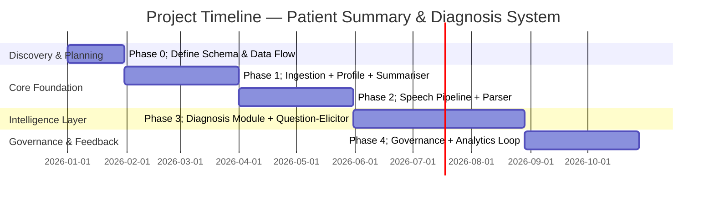
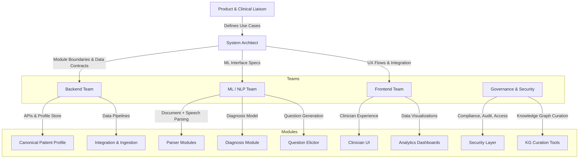
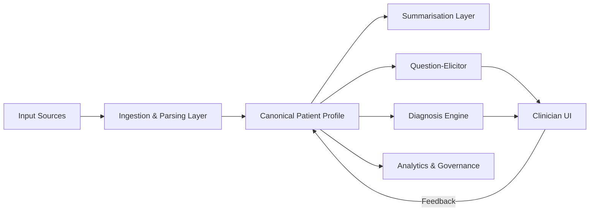

# Visual Addendum — Stakeholder Handout

## 1. Project Timeline & Milestones (Visual)

**Notes:**

* Each phase delivers an independent, testable system increment.
* Governance & feedback work continues in parallel after Phase 3.

---

## 2. Team Ownership Map

**Ownership summary:**

* **Backend team:** Profile store, ingestion pipelines, API layer.
* **ML/NLP team:** Parsing, diagnosis reasoning, question elicitation.
* **Frontend team:** Clinician dashboard, feedback tools, analytics.
* **Governance team:** KG curation, security, compliance.
* **Product & Clinical liaison:** requirements validation, clinician feedback, prioritization.

---

## 3. Module Complexity & Risk Heatmap (Indicative)

| Module               | Complexity | Risk Level | Key Risk                          |
| -------------------- | ---------- | ---------- | --------------------------------- |
| Profile Store        | Medium     | Low        | Schema evolution & consistency    |
| Unstructured Parser  | High       | High       | NLP accuracy & temporal reasoning |
| Speech Parser        | High       | Medium     | Latency & noise handling          |
| Summariser           | Low        | Low        | Quality of summarization          |
| Question Elicitor    | Medium     | Medium     | Diagnostic relevance of questions |
| Diagnosis Module     | High       | High       | Explainability & validation       |
| KG Curation          | Medium     | Medium     | Evidence sourcing & versioning    |
| UI Layer             | Medium     | Low        | Clinician usability               |
| Analytics & Feedback | Low        | Low        | Data governance                   |

---

## 4. Visual Summary of System Layers

**Layer descriptions:**

* **Ingestion & Parsing Layer:** Responsible for converting heterogeneous input into structured facts.
* **Profile Layer:** Maintains authoritative patient data.
* **Reasoning Layer:** Includes summarisation, question elicitor, and diagnosis engine.
* **Presentation Layer:** Clinician interface with live updates and controls.
* **Governance Layer:** Ensures auditability, compliance, and feedback loops.

---

**Purpose of this Visual Addendum:** To complement the main HLD document with an executive-level overview of project phases, ownership, risks, and dependencies — supporting leadership alignment and planning discussions.
